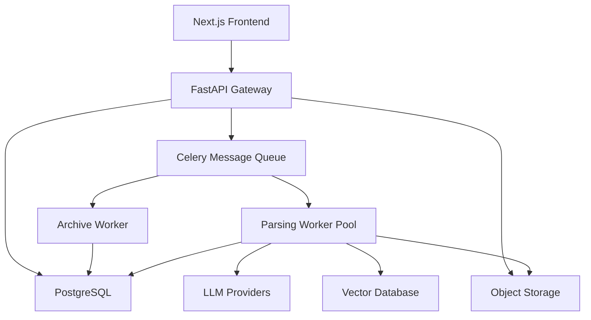

# Document Intelligence & Parsing Center (DIPC)

[](https://github.com/your-org/dipc/actions)
[](https://codecov.io/gh/your-org/dipc)
[](https://opensource.org/licenses/MIT)
[](https://www.python.org/downloads/)
[](https://nodejs.org/)

A comprehensive document processing system that leverages multi-modal Large Language Models (LLMs) to extract structured information from various document formats including PDFs, images, and ZIP archives.

## 🚀 Features

- **Multi-format Support**: Process PDFs, images, text files, and ZIP archives
- **Batch Processing**: Handle multiple documents simultaneously through ZIP archives
- **Cost Management**: Built-in cost estimation and limiting capabilities
- **Flexible Storage**: Choose between permanent and temporary storage policies
- **Vectorization**: Optional vector database storage for semantic search
- **Real-time Monitoring**: Track processing status and progress in real-time
- **Web Interface**: User-friendly React-based frontend
- **REST API**: Comprehensive API for programmatic access
- **Scalable Architecture**: Microservices-based design with Docker support

## 🏗️ Architecture



## 🛠️ Technology Stack

### Backend
- **API Gateway**: FastAPI with Python 3.11+
- **Message Queue**: Celery with Redis/RabbitMQ
- **Database**: PostgreSQL with SQLAlchemy
- **Storage**: S3-compatible object storage (AWS S3, MinIO)
- **Vector Database**: Qdrant or Milvus (optional)

### Frontend
- **Framework**: Next.js 14 with TypeScript
- **UI Components**: shadcn/ui with Tailwind CSS
- **State Management**: React hooks and context
- **Testing**: Jest with React Testing Library

### Infrastructure
- **Containerization**: Docker and Docker Compose
- **Orchestration**: Kubernetes support
- **Monitoring**: Prometheus and Grafana
- **Logging**: Structured logging with correlation IDs

## 🚀 Quick Start

### Prerequisites

- Docker 20.10+
- Docker Compose 2.0+
- Git

### Installation

1. **Clone the repository**
   ```bash
   git clone https://github.com/your-org/dipc.git
   cd dipc
   ```

2. **Set up environment variables**
   ```bash
   cp .env.example .env
   # Edit .env with your configuration
   nano .env
   ```

3. **Start the services**
   ```bash
   docker-compose up -d
   ```

4. **Run database migrations**
   ```bash
   docker-compose exec api python -m alembic upgrade head
   ```

5. **Access the application**
   - Frontend: http://localhost:3000
   - API: http://localhost:8000
   - API Documentation: http://localhost:8000/docs

## 📖 Documentation

- **[User Guide](docs/user-guide.md)**: Complete guide for end users
- **[API Reference](docs/api/api_reference.md)**: Detailed API documentation
- **[Deployment Guide](docs/deployment/README.md)**: Production deployment instructions
- **[Troubleshooting](docs/troubleshooting.md)**: Common issues and solutions

## 🔧 Configuration

### Environment Variables

Key configuration options in `.env`:

```bash
# Database
DATABASE_URL=postgresql://user:pass@db:5432/dipc_db

# Redis
REDIS_URL=redis://redis:6379/0

# Object Storage
S3_ENDPOINT=https://s3.amazonaws.com
S3_BUCKET=dipc-storage
S3_ACCESS_KEY=your_access_key
S3_SECRET_KEY=your_secret_key

# LLM Provider
OPENAI_API_KEY=sk-your-openai-key
OPENROUTER_API_KEY=sk-or-your-openrouter-key

# Vector Database (Optional)
QDRANT_URL=http://qdrant:6333
```

### Supported LLM Providers

- **OpenAI**: GPT-4, GPT-3.5-turbo with vision capabilities
- **OpenRouter**: Access to multiple model providers
- **LiteLLM**: Unified interface for various providers
- **Custom**: Any OpenAI-compatible endpoint

## 🧪 Testing

### Run All Tests

```bash
# Run comprehensive test suite
./run_all_tests.sh

# Run specific test types
./run_all_tests.sh unit
./run_all_tests.sh integration api
./run_all_tests.sh security
```

### Test Categories

- **Unit Tests**: Component-level testing
- **Integration Tests**: End-to-end workflow testing
- **Performance Tests**: Load and stress testing
- **Security Tests**: Security vulnerability testing
- **Load Tests**: High-volume stress testing

### Coverage Reports

After running tests with coverage:
- API: `api/htmlcov/index.html`
- Workers: `workers/htmlcov/index.html`
- Frontend: `frontend/coverage/lcov-report/index.html`

## 📊 Monitoring

### Health Checks

```bash
# API Health
curl http://localhost:8000/v1/health

# Worker Health
curl http://localhost:8001/health

# System Health
curl http://localhost:8000/v1/health/system
```

### Metrics and Monitoring

- **Prometheus**: http://localhost:9090
- **Grafana**: http://localhost:3001
- **Application Metrics**: Request rates, response times, error rates
- **System Metrics**: CPU, memory, disk usage
- **Business Metrics**: Task completion rates, processing costs

## 🔒 Security

### Security Features

- **Input Validation**: Comprehensive request validation
- **File Security**: ZIP bomb protection, path traversal prevention
- **Rate Limiting**: Configurable rate limits per user
- **Secure Storage**: Encrypted file storage with TTL policies
- **Audit Logging**: Complete audit trail of all operations

### Security Testing

```bash
# Run security test suite
./run_all_tests.sh security

# Vulnerability scanning
docker run --rm -v $(pwd):/src trufflesecurity/trufflehog filesystem /src
```

## 🚀 Deployment

### Development

```bash
docker-compose -f docker-compose.yml -f docker-compose.dev.yml up -d
```

### Production

```bash
docker-compose -f docker-compose.yml -f docker-compose.prod.yml up -d
```

### Kubernetes

```bash
kubectl apply -f k8s/
```

See the [Deployment Guide](docs/deployment/README.md) for detailed instructions.

## 📈 Performance

### Benchmarks

- **Throughput**: 100+ documents per minute
- **Latency**: <2s average response time
- **Concurrency**: 50+ concurrent users
- **Scalability**: Horizontal scaling with load balancing

### Optimization Tips

- Use appropriate worker scaling based on load
- Implement caching for frequently accessed data
- Optimize database queries with proper indexing
- Configure CDN for static assets

## 🤝 Contributing

We welcome contributions! Please see our [Contributing Guide](CONTRIBUTING.md) for details.

### Development Setup

1. **Fork and clone the repository**
2. **Set up development environment**
   ```bash
   # Backend development
   cd api
   python -m venv venv
   source venv/bin/activate
   pip install -r requirements.txt
   
   # Frontend development
   cd frontend
   npm install
   npm run dev
   ```

3. **Run tests before submitting**
   ```bash
   ./run_all_tests.sh unit
   ```

### Code Style

- **Python**: Black, isort, flake8
- **TypeScript**: ESLint, Prettier
- **Commit Messages**: Conventional Commits format

## 📄 License

This project is licensed under the MIT License - see the [LICENSE](LICENSE) file for details.

## 🆘 Support

### Getting Help

- **Documentation**: [docs.dipc.wendanai.com](https://docs.dipc.wendanai.com)
- **Issues**: [GitHub Issues](https://github.com/your-org/dipc/issues)
- **Discussions**: [GitHub Discussions](https://github.com/your-org/dipc/discussions)
- **Email**: support@dipc.wendanai.com

### Status Page

Check system status at [status.dipc.wendanai.com](https://status.dipc.wendanai.com)

## 🗺️ Roadmap

### Version 1.4 (Q2 2024)
- [ ] API key authentication
- [ ] Webhook notifications
- [ ] Advanced OCR capabilities
- [ ] Multi-language support improvements

### Version 1.5 (Q3 2024)
- [ ] Real-time collaboration features
- [ ] Advanced analytics dashboard
- [ ] Custom model fine-tuning
- [ ] Mobile application

### Version 2.0 (Q4 2024)
- [ ] Multi-tenant architecture
- [ ] Advanced workflow automation
- [ ] Enterprise SSO integration
- [ ] Advanced security features

## 📊 Statistics

- **Lines of Code**: 50,000+
- **Test Coverage**: 85%+
- **Docker Images**: 4 (API, Workers, Frontend, Database)
- **Supported File Types**: 10+
- **API Endpoints**: 15+

## 🏆 Acknowledgments

- **OpenAI** for GPT models and API
- **FastAPI** for the excellent web framework
- **Next.js** for the React framework
- **shadcn/ui** for beautiful UI components
- **Celery** for distributed task processing
- **PostgreSQL** for reliable data storage

---

**Built with ❤️ by the DIPC Team**

For more information, visit our [website](https://dipc.wen dan ai.com) or check out the [documentation](https://docs.dipc.wendanai.com).