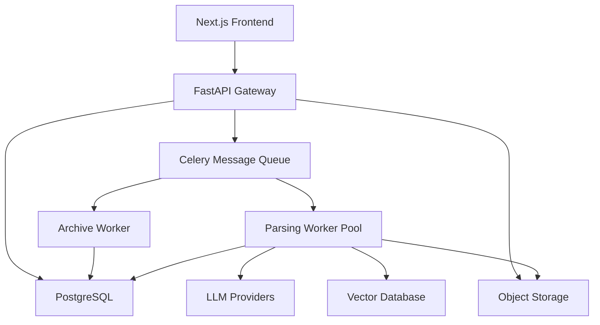

# Document Intelligence & Parsing Center (DIPC)

[](https://github.com/nociex/DIPC/actions)
[](https://opensource.org/licenses/MIT)
[](https://www.python.org/downloads/)
[](https://nodejs.org/)
[](https://github.com/nociex/DIPC/pkgs/container/dipc-api)

A comprehensive document processing system that leverages multi-modal Large Language Models (LLMs) to extract structured information from various document formats including PDFs, images, and ZIP archives.

## 🚀 Features

- **Multi-format Support**: Process PDFs, images, text files, and ZIP archives
- **Batch Processing**: Handle multiple documents simultaneously through ZIP archives
- **Cost Management**: Built-in cost estimation and limiting capabilities
- **Flexible Storage**: Choose between permanent and temporary storage policies
- **Vectorization**: Optional vector database storage for semantic search
- **Real-time Monitoring**: Track processing status and progress in real-time
- **Web Interface**: User-friendly React-based frontend
- **REST API**: Comprehensive API for programmatic access
- **Scalable Architecture**: Microservices-based design with Docker support

## 🏗️ Architecture



## 🛠️ Technology Stack

### Backend
- **API Gateway**: FastAPI with Python 3.11+
- **Message Queue**: Celery with Redis/RabbitMQ
- **Database**: PostgreSQL with SQLAlchemy
- **Storage**: S3-compatible object storage (AWS S3, MinIO)
- **Vector Database**: Qdrant or Milvus (optional)

### Frontend
- **Framework**: Next.js 14 with TypeScript
- **UI Components**: shadcn/ui with Tailwind CSS
- **State Management**: React hooks and context
- **Testing**: Jest with React Testing Library

### Infrastructure
- **Containerization**: Docker and Docker Compose
- **Orchestration**: Kubernetes support
- **Monitoring**: Prometheus and Grafana
- **Logging**: Structured logging with correlation IDs

## 🚀 Quick Start

### 方法一：使用预构建的 Docker 镜像（推荐，最简单！）

我们提供了预构建的多架构 Docker 镜像，让您可以在 3 分钟内完成部署。

**🚀 支持的系统架构**：
- ✅ **x86_64/amd64**：Intel、AMD 处理器的 Windows、Linux、Mac
- ✅ **arm64/aarch64**：Apple Silicon Mac (M1/M2/M3)、ARM 服务器、树莓派 4/5

#### 前置要求

- Docker 20.10+ （[安装指南](https://docs.docker.com/get-docker/)）
- Docker Compose 2.0+ （通常随 Docker Desktop 一起安装）

#### 🚀 超简单部署方式

##### 选项 A：一键部署脚本（最简单！）

```bash
# 下载并运行快速部署脚本
curl -fsSL https://raw.githubusercontent.com/nociex/DIPC/main/quick-deploy.sh | bash
```

脚本会自动：
- ✅ 检查 Docker 环境
- ✅ 下载必要的配置文件  
- ✅ 引导您配置 API Key
- ✅ 拉取镜像并启动服务
- ✅ 验证服务运行状态

##### 选项 B：手动部署

1. **下载配置文件**
   ```bash
   # 创建项目目录
   mkdir dipc && cd dipc
   
   # 下载 docker-compose 文件（已配置使用预构建镜像）
   curl -O https://raw.githubusercontent.com/nociex/DIPC/main/docker-compose.yml
   
   # 下载数据库初始化脚本
   curl -O https://raw.githubusercontent.com/nociex/DIPC/main/db/init.sql
   mkdir -p db && mv init.sql db/
   ```

2. **创建配置文件**
   ```bash
   # 创建环境变量文件（只需要配置 API key）
   cat > .env << EOF
   # 选择一个 LLM Provider（必需）
   # 选项 1：使用 OpenAI
   OPENAI_API_KEY=sk-your-openai-key
   
   # 选项 2：使用 OpenRouter（支持更多模型）
   # OPENROUTER_API_KEY=sk-or-your-openrouter-key
   
   # 选项 3：使用兼容 OpenAI API 的其他服务
   # OPENAI_API_KEY=your-api-key
   # OPENAI_API_BASE=https://your-api-endpoint.com/v1
   EOF
   ```

3. **启动应用**
   ```bash
   # 拉取镜像并启动所有服务
   docker-compose pull
   docker-compose up -d
   
   # 查看启动状态
   docker-compose ps
   
   # 查看日志（可选）
   docker-compose logs -f
   ```

4. **访问应用** 🎉
   - 📱 前端界面: http://localhost:3000
   - 🔌 API 接口: http://localhost:38100
   - 📚 API 文档: http://localhost:38100/docs

#### 常见问题解决

1. **如果端口被占用**
   编辑 `docker-compose.yml`，修改端口映射：
   ```yaml
   ports:
     - "3001:3000"  # 前端改为 3001
     - "38101:8000" # API 改为 38101
   ```

2. **如果需要使用代理**
   在 `.env` 文件中添加：
   ```bash
   HTTP_PROXY=http://your-proxy:port
   HTTPS_PROXY=http://your-proxy:port
   ```

3. **查看服务状态**
   ```bash
   # 检查所有服务是否正常运行
   docker-compose ps
   
   # 检查 API 健康状态
   curl http://localhost:38100/v1/health
   ```

### 方法二：从源码构建

如果您想自定义构建或开发：

1. **克隆仓库**
   ```bash
   git clone https://github.com/nociex/DIPC.git
   cd DIPC
   ```

2. **设置环境变量**
   ```bash
   cp .env.example .env
   # 编辑 .env 配置您的 API keys
   nano .env
   ```

3. **构建并启动服务**
   ```bash
   # 使用开发环境配置文件构建
   docker-compose -f docker-compose.simple.yml up -d --build
   ```

4. **运行数据库迁移**
   ```bash
   docker-compose exec api python -m alembic upgrade head
   ```

5. **访问应用**
   - 前端界面: http://localhost:3000
   - API 接口: http://localhost:38100
   - API 文档: http://localhost:38100/docs

### 🐳 Docker 镜像说明

我们提供以下预构建的 Docker 镜像，全部支持多架构（Multi-Architecture）：

| 镜像名称 | 说明 | 支持架构 |
|---------|------|---------|
| `ghcr.io/nociex/dipc-api:latest` | API 网关服务 | `linux/amd64`, `linux/arm64` |
| `ghcr.io/nociex/dipc-worker:latest` | 文档处理工作器 | `linux/amd64`, `linux/arm64` |
| `ghcr.io/nociex/dipc-frontend:latest` | Web 前端界面 | `linux/amd64`, `linux/arm64` |

**多架构支持说明**：
- ✅ **Intel/AMD 处理器**：完全支持 x86_64/amd64 架构
- ✅ **Apple Silicon (M1/M2/M3)**：原生支持 ARM64 架构，无需 Rosetta 转译
- ✅ **ARM 服务器**：支持 AWS Graviton、树莓派 4/5 等 ARM64 设备
- ✅ **自动架构选择**：Docker 会自动拉取适合您系统架构的镜像

您也可以使用特定版本标签，例如：
- `ghcr.io/nociex/dipc-api:v1.0.0` - 特定版本
- `ghcr.io/nociex/dipc-api:main-a1b2c3d` - 特定提交
- `ghcr.io/nociex/dipc-api:latest` - 最新稳定版本

## 📖 Documentation

- **[User Guide](docs/user-guide.md)**: Complete guide for end users
- **[API Reference](docs/api/api_reference.md)**: Detailed API documentation
- **[Deployment Guide](docs/deployment/README.md)**: Production deployment instructions
- **[Troubleshooting](docs/troubleshooting.md)**: Common issues and solutions

## 🔧 Configuration

### Environment Variables

Key configuration options in `.env`:

```bash
# Database
DATABASE_URL=postgresql://user:pass@db:5432/dipc_db

# Redis
REDIS_URL=redis://redis:6379/0

# Object Storage
S3_ENDPOINT=https://s3.amazonaws.com
S3_BUCKET=dipc-storage
S3_ACCESS_KEY=your_access_key
S3_SECRET_KEY=your_secret_key

# LLM Provider
OPENAI_API_KEY=sk-your-openai-key
OPENROUTER_API_KEY=sk-or-your-openrouter-key

# Vector Database (Optional)
QDRANT_URL=http://qdrant:6333
```

### Supported LLM Providers

- **OpenAI**: GPT-4, GPT-3.5-turbo with vision capabilities
- **OpenRouter**: Access to multiple model providers
- **LiteLLM**: Unified interface for various providers
- **Custom**: Any OpenAI-compatible endpoint

## 🧪 Testing

### Run All Tests

```bash
# Run comprehensive test suite
./run_all_tests.sh

# Run specific test types
./run_all_tests.sh unit
./run_all_tests.sh integration api
./run_all_tests.sh security
```

### Test Categories

- **Unit Tests**: Component-level testing
- **Integration Tests**: End-to-end workflow testing
- **Performance Tests**: Load and stress testing
- **Security Tests**: Security vulnerability testing
- **Load Tests**: High-volume stress testing

### Coverage Reports

After running tests with coverage:
- API: `api/htmlcov/index.html`
- Workers: `workers/htmlcov/index.html`
- Frontend: `frontend/coverage/lcov-report/index.html`

## 📊 Monitoring

### Health Checks

```bash
# API Health
curl http://localhost:8000/v1/health

# Worker Health
curl http://localhost:8001/health

# System Health
curl http://localhost:8000/v1/health/system
```

### Metrics and Monitoring

- **Prometheus**: http://localhost:9090
- **Grafana**: http://localhost:3001
- **Application Metrics**: Request rates, response times, error rates
- **System Metrics**: CPU, memory, disk usage
- **Business Metrics**: Task completion rates, processing costs

## 🔒 Security

### Security Features

- **Input Validation**: Comprehensive request validation
- **File Security**: ZIP bomb protection, path traversal prevention
- **Rate Limiting**: Configurable rate limits per user
- **Secure Storage**: Encrypted file storage with TTL policies
- **Audit Logging**: Complete audit trail of all operations

### Security Testing

```bash
# Run security test suite
./run_all_tests.sh security

# Vulnerability scanning
docker run --rm -v $(pwd):/src trufflesecurity/trufflehog filesystem /src
```

## 🚀 Deployment

### Development

```bash
docker-compose -f docker-compose.yml -f docker-compose.dev.yml up -d
```

### Production

```bash
docker-compose -f docker-compose.yml -f docker-compose.prod.yml up -d
```

### Kubernetes

```bash
kubectl apply -f k8s/
```

See the [Deployment Guide](docs/deployment/README.md) for detailed instructions.

## 📈 Performance

### Benchmarks

- **Throughput**: 100+ documents per minute
- **Latency**: <2s average response time
- **Concurrency**: 50+ concurrent users
- **Scalability**: Horizontal scaling with load balancing

### Optimization Tips

- Use appropriate worker scaling based on load
- Implement caching for frequently accessed data
- Optimize database queries with proper indexing
- Configure CDN for static assets

## 🤝 Contributing

We welcome contributions! Please see our [Contributing Guide](CONTRIBUTING.md) for details.

### Development Setup

1. **Fork and clone the repository**
2. **Set up development environment**
   ```bash
   # Backend development
   cd api
   python -m venv venv
   source venv/bin/activate
   pip install -r requirements.txt
   
   # Frontend development
   cd frontend
   npm install
   npm run dev
   ```

3. **Run tests before submitting**
   ```bash
   ./run_all_tests.sh unit
   ```

### Code Style

- **Python**: Black, isort, flake8
- **TypeScript**: ESLint, Prettier
- **Commit Messages**: Conventional Commits format

## 📄 License

This project is licensed under the MIT License - see the [LICENSE](LICENSE) file for details.

## 🆘 Support

### Getting Help

- **Documentation**: 查看本 README 和 docs 目录
- **Issues**: [GitHub Issues](https://github.com/nociex/DIPC/issues)
- **Discussions**: [GitHub Discussions](https://github.com/nociex/DIPC/discussions)
- **Docker Images**: [GitHub Container Registry](https://github.com/nociex/DIPC/pkgs/container/dipc-api)

## 🗺️ Roadmap

### Version 1.4 (Q2 2024)
- [ ] API key authentication
- [ ] Webhook notifications
- [ ] Advanced OCR capabilities
- [ ] Multi-language support improvements

### Version 1.5 (Q3 2024)
- [ ] Real-time collaboration features
- [ ] Advanced analytics dashboard
- [ ] Custom model fine-tuning
- [ ] Mobile application

### Version 2.0 (Q4 2024)
- [ ] Multi-tenant architecture
- [ ] Advanced workflow automation
- [ ] Enterprise SSO integration
- [ ] Advanced security features

## 📊 Statistics

- **Lines of Code**: 50,000+
- **Test Coverage**: 85%+
- **Docker Images**: 4 (API, Workers, Frontend, Database)
- **Supported File Types**: 10+
- **API Endpoints**: 15+

## 🏆 Acknowledgments

- **OpenAI** for GPT models and API
- **FastAPI** for the excellent web framework
- **Next.js** for the React framework
- **shadcn/ui** for beautiful UI components
- **Celery** for distributed task processing
- **PostgreSQL** for reliable data storage

---

**Built with ❤️ by the DIPC Team**

更多信息请访问 [GitHub 仓库](https://github.com/nociex/DIPC) 或查看 [预构建镜像](https://github.com/nociex/DIPC/packages)。