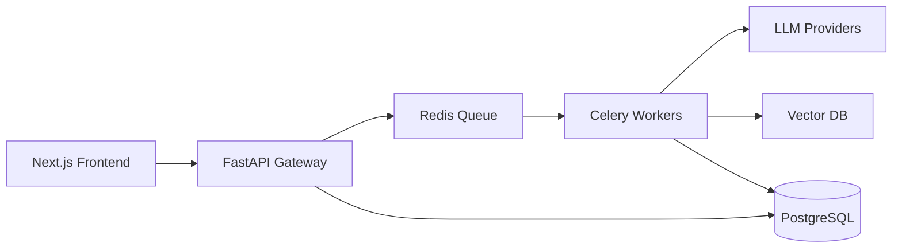

# Document Intelligence & Parsing Center (DIPC)

<div align="center">

[](https://github.com/nociex/DIPC/actions)
[](https://opensource.org/licenses/MIT)
[](https://www.python.org/downloads/)
[](https://github.com/nociex/DIPC/pkgs/container/dipc-api)

[English](README.md) | [简体中文](README.zh-CN.md)

</div>

## Overview

DIPC is an enterprise-grade document processing system that leverages multi-modal LLMs to extract structured information from various document formats. Built with a microservices architecture, it provides high-performance, scalable document intelligence capabilities.

## ✨ Key Features

- **📄 Multi-Format Support** - PDFs, images (JPG/PNG/GIF/WEBP), text files, and ZIP archives
- **🚀 High Performance** - Asynchronous processing with distributed workers
- **💰 Cost Management** - Built-in estimation and usage limiting
- **🔍 Vector Search** - Optional semantic search capabilities
- **🌐 Multi-Architecture** - Native support for x86_64 and ARM64 (including Apple Silicon)
- **🔒 Enterprise Ready** - Production-grade security and monitoring

## 🚀 Quick Start (3 minutes)

### Prerequisites
- Docker 20.10+ ([Install Guide](https://docs.docker.com/get-docker/))
- Docker Compose 2.0+

### Deploy with Pre-built Images

```bash
# 1. Create project directory
mkdir dipc && cd dipc

# 2. Download configuration
curl -O https://raw.githubusercontent.com/nociex/DIPC/main/docker-compose.yml
curl -O https://raw.githubusercontent.com/nociex/DIPC/main/.env.example

# 3. Configure API key
cp .env.example .env
# Edit .env and add your OpenAI/OpenRouter API key

# 4. Start services
docker compose up -d

# 5. Access the application
# Frontend: http://localhost:38110
# API Docs: http://localhost:38100/docs
```

## 🏗️ Architecture

<div align="center">



</div>

## 📊 Performance

- **Processing Speed**: 10-50 pages/minute (depending on complexity)
- **Concurrent Jobs**: Up to 100 simultaneous documents
- **API Latency**: <100ms for most endpoints
- **Storage**: S3-compatible object storage support

## 🔧 Configuration

### Basic Configuration

```env
# Required: Choose one LLM provider
OPENAI_API_KEY=sk-your-key
# OR
OPENROUTER_API_KEY=sk-or-your-key

# Optional: Advanced settings
MAX_WORKERS=4
PROCESSING_TIMEOUT=300
VECTOR_DB_ENABLED=true
```

### Advanced Deployment

For production deployments, Kubernetes configurations, and advanced settings, see the [Deployment Guide](docs/deployment/README.md).

## 📚 Documentation

- [User Guide](docs/user-guide.md) - Getting started and features
- [API Reference](docs/api/api_reference.md) - Complete API documentation
- [Architecture](docs/architecture.md) - System design and components
- [Troubleshooting](docs/troubleshooting.md) - Common issues and solutions

## 🤝 Contributing

We welcome contributions! Please see our [Contributing Guide](CONTRIBUTING.md) for details.

## 📄 License

This project is licensed under the MIT License - see the [LICENSE](LICENSE) file for details.

## 🙏 Acknowledgments

Built with excellent open-source technologies including FastAPI, Next.js, Celery, and more.

---

<div align="center">
Made with ❤️ by the DIPC Team
</div>