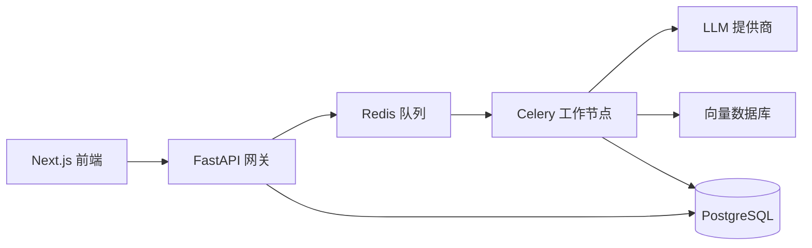

# 文档智能解析中心 (DIPC)

<div align="center">

[](https://github.com/nociex/DIPC/actions)
[](https://opensource.org/licenses/MIT)
[](https://www.python.org/downloads/)
[](https://github.com/nociex/DIPC/pkgs/container/dipc-api)

[English](README.md) | [简体中文](README.zh-CN.md)

</div>

## 项目概述

DIPC 是一个企业级文档处理系统，利用多模态大语言模型（LLM）从各种文档格式中提取结构化信息。采用微服务架构设计，提供高性能、可扩展的文档智能处理能力。

## ✨ 核心特性

- **📄 多格式支持** - 支持 PDF、图片（JPG/PNG/GIF/WEBP）、文本文件和 ZIP 压缩包
- **🚀 高性能处理** - 异步处理架构，分布式工作节点
- **💰 成本管理** - 内置成本估算和使用限制功能
- **🔍 向量搜索** - 可选的语义搜索能力
- **🌐 多架构支持** - 原生支持 x86_64 和 ARM64（包括 Apple Silicon）
- **🔒 企业级就绪** - 生产级安全和监控功能

## 🚀 快速开始（3分钟部署）

### 前置要求
- Docker 20.10+ ([安装指南](https://docs.docker.com/get-docker/))
- Docker Compose 2.0+

### 使用预构建镜像部署

```bash
# 1. 创建项目目录
mkdir dipc && cd dipc

# 2. 下载配置文件
curl -O https://raw.githubusercontent.com/nociex/DIPC/main/docker-compose.yml
curl -O https://raw.githubusercontent.com/nociex/DIPC/main/.env.example

# 3. 配置 API 密钥
cp .env.example .env
# 编辑 .env 文件，添加您的 OpenAI/OpenRouter API 密钥

# 4. 启动服务
docker compose up -d

# 5. 访问应用
# 前端界面: http://localhost:38110
# API 文档: http://localhost:38100/docs
```

## 🏗️ 系统架构

<div align="center">



</div>

## 📊 性能指标

- **处理速度**: 10-50 页/分钟（取决于文档复杂度）
- **并发处理**: 支持多达 100 个文档同时处理
- **API 延迟**: 大多数接口响应时间 <100ms
- **存储支持**: 兼容 S3 的对象存储

## 🔧 配置说明

### 基础配置

```env
# 必需：选择一个 LLM 提供商
OPENAI_API_KEY=sk-your-key
# 或者
OPENROUTER_API_KEY=sk-or-your-key

# 可选：高级设置
MAX_WORKERS=4
PROCESSING_TIMEOUT=300
VECTOR_DB_ENABLED=true
```

### 高级部署

关于生产环境部署、Kubernetes 配置和高级设置，请参阅[部署指南](docs/deployment/README.md)。

## 📚 文档

- [用户指南](docs/user-guide.md) - 入门指南和功能介绍
- [API 参考](docs/api/api_reference.md) - 完整的 API 文档
- [系统架构](docs/architecture.md) - 系统设计和组件说明
- [故障排除](docs/troubleshooting.md) - 常见问题和解决方案

## 🤝 贡献指南

我们欢迎各种形式的贡献！详情请查看[贡献指南](CONTRIBUTING.md)。

## 📄 许可证

本项目采用 MIT 许可证 - 详见 [LICENSE](LICENSE) 文件。

## 🙏 致谢

感谢 FastAPI、Next.js、Celery 等优秀的开源技术。

---

<div align="center">
由 DIPC 团队用 ❤️ 打造
</div>